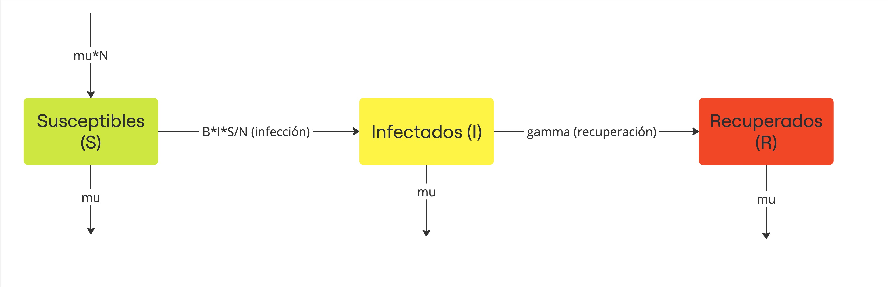
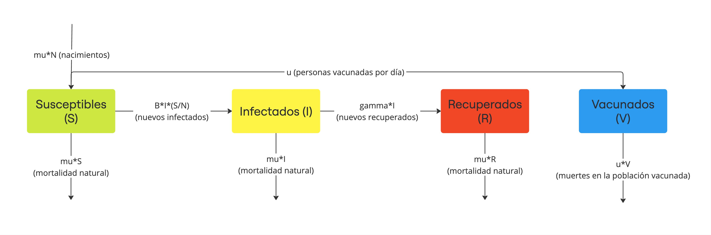
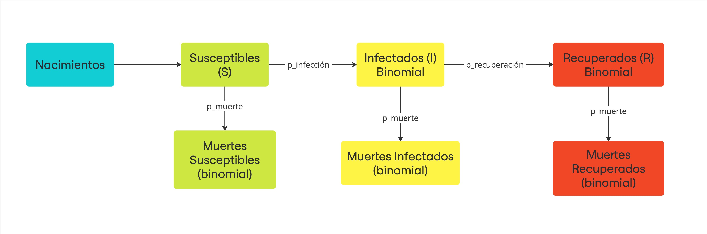
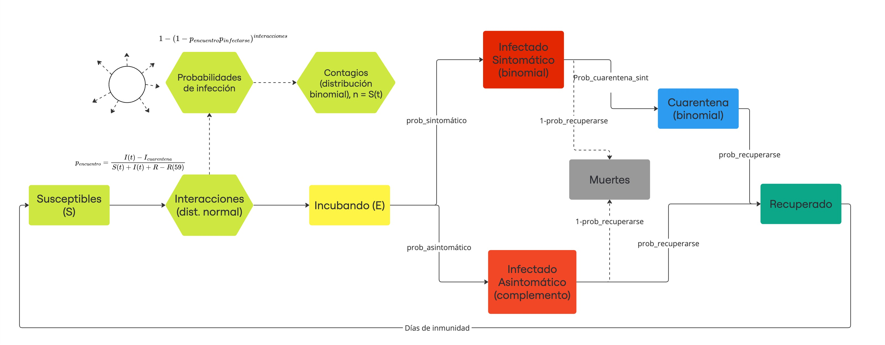

# Epidemiological Models Simulator in R with Shiny

## Description 📑
This proyect is an interactive web application, developed with Shiny to explore and visualize various mathematical and stochastic models related to the spread of infectious diseases, specifically Covid-19.

## Key Features 📊

1. **Deterministic Models**: The included deterministic models are based on 
systems of ODE's that describe how different population groups (Succeptible, Infected, Recovered) evolve over time. They assume a closed and homogeneous population, where every individual interacts the same way. 

    * **SIR Model**: 
        * The population is divided into three groups: 
            - S: Susceptible individuals who can catch the disease.
            - I: Infected individuals who can spread the disease.
            - R: Recovered individuals who are no longer susceptible or infectious 

        * The model uses parameters like transmission rate and recovery rate to simulate disease dynamics. Also R_0, the basic reproduction number, is a metric to understand if a pandemic will spread or decline. 

        * 

    * **Extended SIR model with vaccination**: This model incorporates a V (Vaccinated) group to simulate the effects of vaccination campaigns, through a parameter u, representing the number of people vaccinated per day. 
     - 

2. **Stochastic Models**: They introduce **randomness** into the model dynamics, making them more realistic for capturing uncertainties and variations. These model use random variables to model different processes in each part of the model. 

    * **Basic Stochastic Model**: This model uses random variables (Bernoulli and Binomial distribution) to determine wether a succeptible individual becomes infected or an infected individual recovers. 

        - Simulations generate different outcomes even with the same initial conditions, helping explore best and worst case scenarios. 

        - 

    * **Extended Stochastic Model**: This model builds from the previous, but adds more detailed groups, such as: 

        - $\mathbf{E}$: Exposed individuals in the incubation period. 
        - $\mathbf{I_s}$: Symptomatic infected individuals. 
        - $\mathbf{I_a}$: Asymptomatic infected individuals. 
        - $\mathbf{Q}$: Quarantined individuals. 
        - $\mathbf{D}$: Deceased individuals. 
        - $\mathbf{R}$. Recovered individuals with temporary inmunity. 
    
    * Parameters like quarantine probability, mask usage, or vaccination timing allow for simulating the impact of interventions on the epidemic's progression.

    * 

3. **Visual comparisons** 📋
- Through the use of ggplot and different R libraries, the application provides visual toosl to compare: 
    - The effects of vaccination and no vaccination within deterministic models. 
    - Variability in epidemic outcomes due to randomness in stochastic models
    - How interventions (e.g., masks, quarantine) influence outcomes over time.

4. How to run the application: 
    * Clone the repository or download the app.R file.
    * Install the required packages: 
    <pre><code> install.packages(c("shiny", "shinydashboard", "shinyjs", "ggplot2", "deSolve", "ggiraph", "data.table")) </code></pre>
    * Open the app.R file in RStudio. 
    * Run the app using: 
     <pre><code> shiny::runApp() </code></pre>
    * The app will start to run in your web browser. 

##  Authors
- Juan Pablo Guerrero Escudero (A01706810, Campus Querétaro)
- Romina Nájera Fuentes (A01424411, Campus Querétaro)
- Juan Braulio Olivares Rodríguez (A01706880, Campus Querétaro)

    
    

